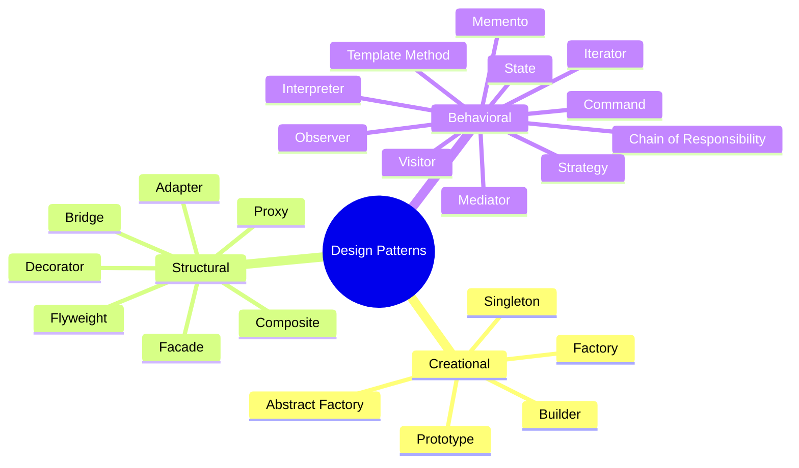

# Design Patterns in TypeScript

A comprehensive collection of the 23 Gang of Four (GoF) design patterns implemented in TypeScript with Bun.

## Reference

These patterns are based on the classic book:

> **"Design Patterns: Elements of Reusable Object-Oriented Software"**  
> by Erich Gamma, Richard Helm, Ralph Johnson, and John Vlissides  
> Addison-Wesley, 1994

Also known as the "Gang of Four" (GoF) book, it remains the definitive reference for object-oriented design patterns.

## Overview



## Patterns

### Creational Patterns

Deal with object creation mechanisms.

| Pattern | Description | Run |
|---------|-------------|-----|
| [Factory](src/creational/factory/README.md) | Create objects without specifying exact class | `bun run creational:factory` |
| [Abstract Factory](src/creational/abstract-factory/README.md) | Create families of related objects | `bun run creational:abstract-factory` |
| [Builder](src/creational/builder/README.md) | Construct complex objects step by step | `bun run creational:builder` |
| [Prototype](src/creational/prototype/README.md) | Clone existing objects | `bun run creational:prototype` |
| [Singleton](src/creational/singleton/README.md) | Ensure single instance | `bun run creational:singleton` |

### Structural Patterns

Deal with object composition.

| Pattern | Description | Run |
|---------|-------------|-----|
| [Adapter](src/structural/adapter/README.md) | Convert interface to expected one | `bun run structural:adapter` |
| [Bridge](src/structural/bridge/README.md) | Separate abstraction from implementation | `bun run structural:bridge` |
| [Composite](src/structural/composite/README.md) | Treat objects and groups uniformly | `bun run structural:composite` |
| [Decorator](src/structural/decorator/README.md) | Add behavior dynamically | `bun run structural:decorator` |
| [Facade](src/structural/facade/README.md) | Simplify complex subsystems | `bun run structural:facade` |
| [Flyweight](src/structural/flyweight/README.md) | Share common state efficiently | `bun run structural:flyweight` |
| [Proxy](src/structural/proxy/README.md) | Control access to objects | `bun run structural:proxy` |

### Behavioral Patterns

Deal with object communication.

| Pattern | Description | Run |
|---------|-------------|-----|
| [Chain of Responsibility](src/behavioral/chain-of-responsibility/README.md) | Pass request along handler chain | `bun run behavioral:chain-of-responsibility` |
| [Command](src/behavioral/command/README.md) | Encapsulate requests as objects | `bun run behavioral:command` |
| [Interpreter](src/behavioral/interpreter/README.md) | Evaluate language grammar | `bun run behavioral:interpreter` |
| [Iterator](src/behavioral/iterator/README.md) | Access elements sequentially | `bun run behavioral:iterator` |
| [Mediator](src/behavioral/mediator/README.md) | Centralize complex communications | `bun run behavioral:mediator` |
| [Memento](src/behavioral/memento/README.md) | Capture and restore state | `bun run behavioral:memento` |
| [Observer](src/behavioral/observer/README.md) | Notify dependents of changes | `bun run behavioral:observer` |
| [State](src/behavioral/state/README.md) | Alter behavior based on state | `bun run behavioral:state` |
| [Strategy](src/behavioral/strategy/README.md) | Interchange algorithms | `bun run behavioral:strategy` |
| [Template Method](src/behavioral/template-method/README.md) | Define algorithm skeleton | `bun run behavioral:template-method` |
| [Visitor](src/behavioral/visitor/README.md) | Add operations without modifying classes | `bun run behavioral:visitor` |

## Getting Started

```bash
# Install dependencies
bun install

# Run any pattern
bun run <category>:<pattern>

# Example
bun run creational:factory
```

## Project Structure

```
src/
├── creational/
│   ├── factory/
│   ├── abstract-factory/
│   ├── builder/
│   ├── prototype/
│   └── singleton/
├── structural/
│   ├── adapter/
│   ├── bridge/
│   ├── composite/
│   ├── decorator/
│   ├── facade/
│   ├── flyweight/
│   └── proxy/
└── behavioral/
    ├── chain-of-responsibility/
    ├── command/
    ├── interpreter/
    ├── iterator/
    ├── mediator/
    ├── memento/
    ├── observer/
    ├── state/
    ├── strategy/
    ├── template-method/
    └── visitor/
```

## Requirements

- [Bun](https://bun.sh/) v1.0+
- TypeScript 5+
