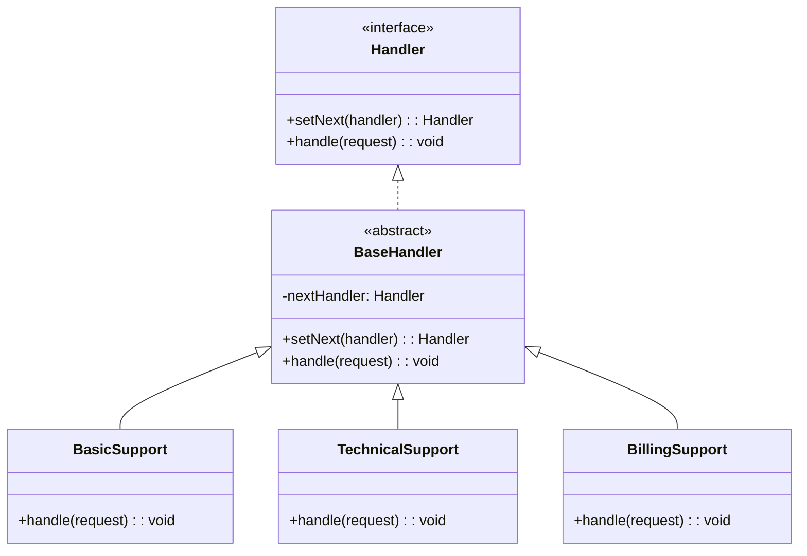
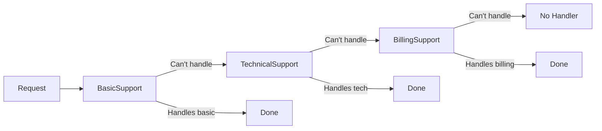

# Chain of Responsibility Pattern

## Intent

Avoid coupling the sender of a request to its receiver by giving more than one object a chance to handle the request. Chain the receiving objects and pass the request along the chain until an object handles it.

## Problem

You have multiple handlers that could process a request, and you want to decouple the sender from the specific handler.

## Solution

Create a chain of handler objects. Each handler decides whether to process the request or pass it to the next handler in the chain.

## Diagram



## Our Example

We implement a customer support system:

- **`types.ts`**: Defines `SupportRequest` and `Handler` interfaces
- **`handlers.ts`**: Base handler and concrete handlers (`BasicSupport`, `TechnicalSupport`, `BillingSupport`)
- **`index.ts`**: Builds the chain and processes different requests

## Request Flow



## Chain Setup

```typescript
const basic = new BasicSupport();
const technical = new TechnicalSupport();
const billing = new BillingSupport();

basic.setNext(technical).setNext(billing);
```

## When to Use

- When more than one object may handle a request
- When you want to issue a request without specifying the receiver
- When the set of handlers should be specified dynamically

## Run

```bash
bun run src/behavioral/chain-of-responsibility/index.ts
```

