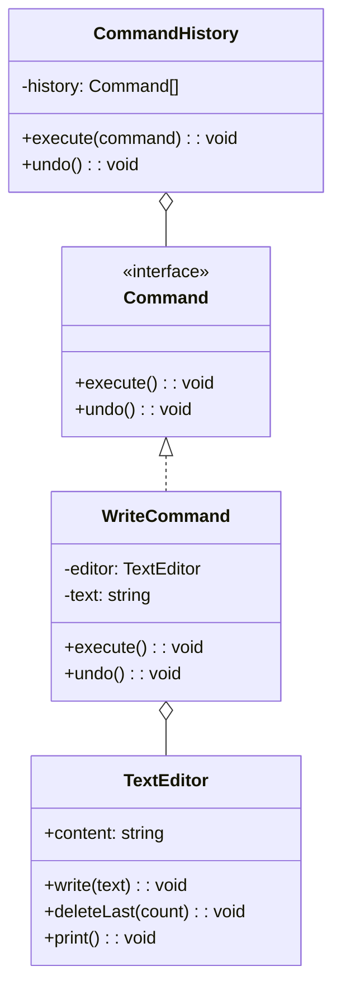
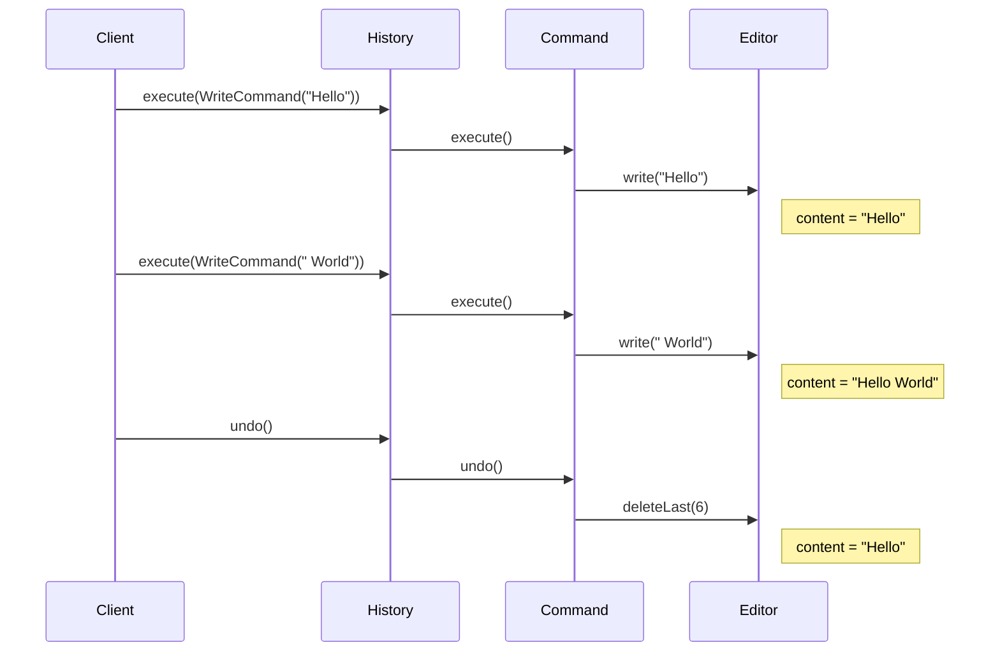

# Command Pattern

## Intent

Encapsulate a request as an object, thereby letting you parameterize clients with different requests, queue or log requests, and support undoable operations.

## Problem

You need to decouple the object that invokes an operation from the one that performs it, and support undo/redo.

## Solution

Create command objects that encapsulate the action and its parameters, with `execute()` and `undo()` methods.

## Diagram



## Our Example

We implement a text editor with undo:

- **`types.ts`**: Defines the `Command` interface
- **`commands.ts`**: `TextEditor`, `WriteCommand`, and `CommandHistory`
- **`index.ts`**: Demonstrates writing and undoing

## Undo Flow



## When to Use

- When you want to parameterize objects with operations
- When you need to queue, specify, and execute requests at different times
- When you need undo/redo functionality
- When you want to log changes for crash recovery

## Run

```bash
bun run behavioral:command
```

