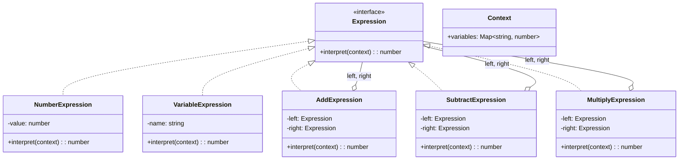
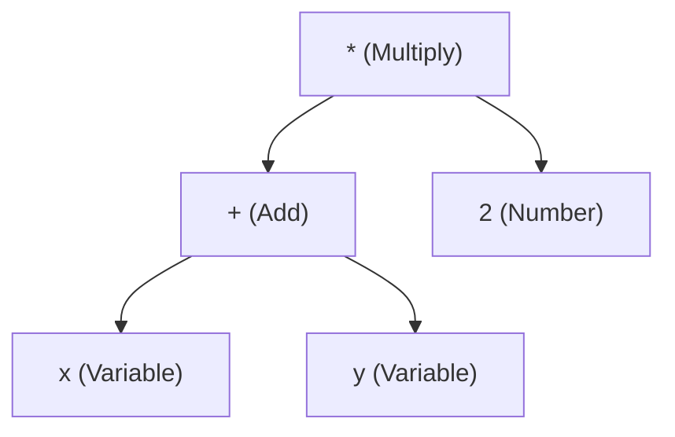
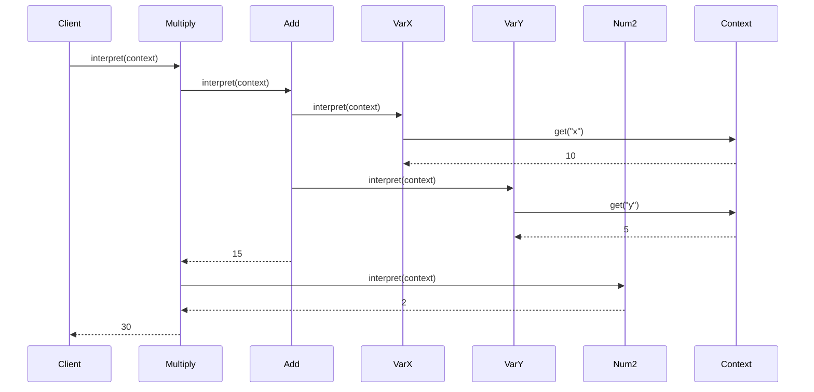

# Interpreter Pattern

## Intent

Given a language, define a representation for its grammar along with an interpreter that uses the representation to interpret sentences in the language.

## Problem

You have a simple language or grammar that needs to be evaluated, and you want a flexible way to parse and execute it.

## Solution

Define an abstract syntax tree (AST) where each node is an expression class with an `interpret()` method that evaluates itself.

## Diagram



## Our Example

We implement a simple arithmetic expression evaluator:

- **`types.ts`**: Defines `Expression` and `Context` interfaces
- **`expressions.ts`**: Terminal (`NumberExpression`, `VariableExpression`) and non-terminal expressions (`AddExpression`, `SubtractExpression`, `MultiplyExpression`, `DivideExpression`)
- **`index.ts`**: Builds and evaluates expression trees

## Expression Tree

For `(x + y) * 2`:



## Evaluation Flow



## Key Concepts

| Term | Description | Example |
|------|-------------|---------|
| **Terminal** | Leaf nodes, don't contain other expressions | `NumberExpression`, `VariableExpression` |
| **Non-terminal** | Composite nodes with child expressions | `AddExpression`, `MultiplyExpression` |
| **Context** | Shared state for interpretation | Variables map |

## Building Expressions

```typescript
// (x + y) * 2
const expr = new MultiplyExpression(
  new AddExpression(
    new VariableExpression("x"),
    new VariableExpression("y")
  ),
  new NumberExpression(2)
);

const result = expr.interpret({ variables: new Map([["x", 10], ["y", 5]]) });
// Result: 30
```

## Real-World Uses

- SQL query parsers
- Regular expression engines
- Mathematical expression evaluators
- Configuration file parsers
- Domain-specific languages (DSLs)

## When to Use

- When you have a simple grammar to interpret
- When efficiency is not critical (complex grammars are better with parser generators)
- When you want to represent statements as abstract syntax trees

## Trade-offs

✅ **Pros**: Easy to extend grammar, each rule is a class  
❌ **Cons**: Complex grammars create many classes, not efficient for large expressions

## Run

```bash
bun run src/behavioral/interpreter/index.ts
```

