# Iterator Pattern

## Intent

Provide a way to access the elements of an aggregate object sequentially without exposing its underlying representation.

## Problem

You need to traverse a collection without exposing its internal structure, and you may need multiple traversal algorithms.

## Solution

Extract the traversal behavior into a separate iterator object that knows how to access the collection's elements.

## Diagram

```mermaid
classDiagram
    class Iterator~T~ {
        <<interface>>
        +hasNext(): boolean
        +next(): T
    }
    
    class IterableCollection~T~ {
        <<interface>>
        +createIterator(): Iterator~T~
    }
    
    class NumberIterator {
        -position: number
        -collection: number[]
        +hasNext(): boolean
        +next(): number
    }
    
    class NumberCollection {
        -items: number[]
        +add(item): void
        +createIterator(): Iterator~number~
    }
    
    Iterator <|.. NumberIterator
    IterableCollection <|.. NumberCollection
    NumberCollection ..> NumberIterator : creates
```



## Our Example

We implement a custom number collection with an iterator:

- **`types.ts`**: Defines `Iterator<T>` and `IterableCollection<T>` interfaces
- **`collection.ts`**: `NumberCollection` and `NumberIterator` implementations
- **`index.ts`**: Demonstrates iteration

## Usage Pattern


## Standard Usage

```typescript
const iterator = collection.createIterator();

while (iterator.hasNext()) {
  console.log(iterator.next());
}
```

## Note

In TypeScript/JavaScript, you can also implement the built-in `Iterable` protocol with `Symbol.iterator` for `for...of` support.

## When to Use

- When you want to access a collection's contents without exposing its internal structure
- When you need multiple traversal methods for a collection
- When you want a uniform interface for traversing different collections

## Run

```bash
bun run behavioral:iterator
```

