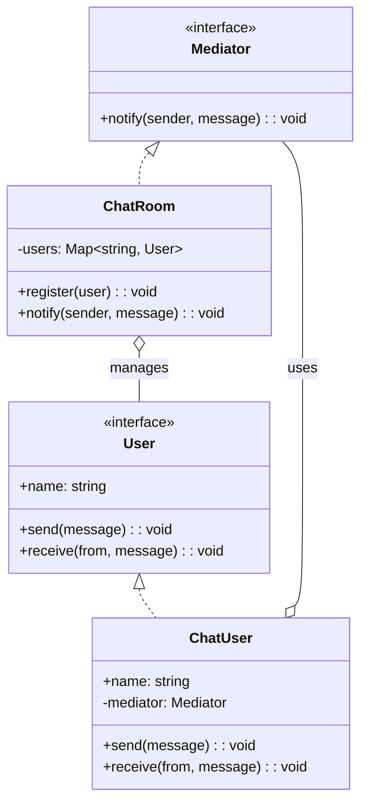
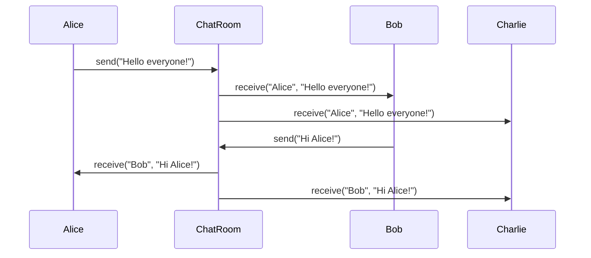
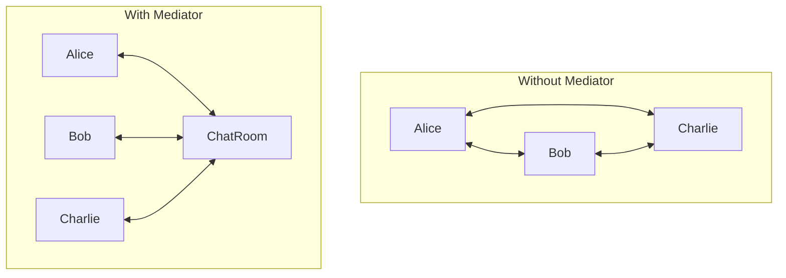

# Mediator Pattern

## Intent

Define an object that encapsulates how a set of objects interact. Mediator promotes loose coupling by keeping objects from referring to each other explicitly.

## Problem

You have many objects that communicate with each other, creating a complex web of dependencies.

## Solution

Introduce a mediator object that handles all communication between objects, so they only know about the mediator.

## Diagram



## Our Example

We implement a chat room:

- **`types.ts`**: Defines `Mediator` and `User` interfaces
- **`chat.ts`**: `ChatRoom` (mediator) and `ChatUser` (colleague)
- **`index.ts`**: Users communicate through the chat room

## Communication Flow



## Without vs With Mediator



## When to Use

- When objects communicate in complex but well-defined ways
- When reusing an object is difficult because it refers to many other objects
- When you want to customize behavior distributed across several classes

## Run

```bash
bun run behavioral:mediator
```

