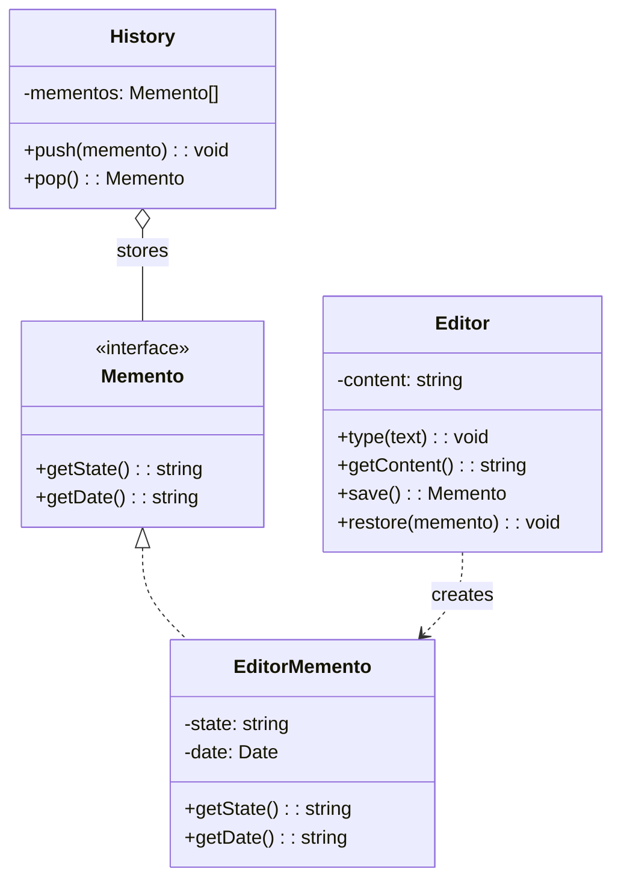
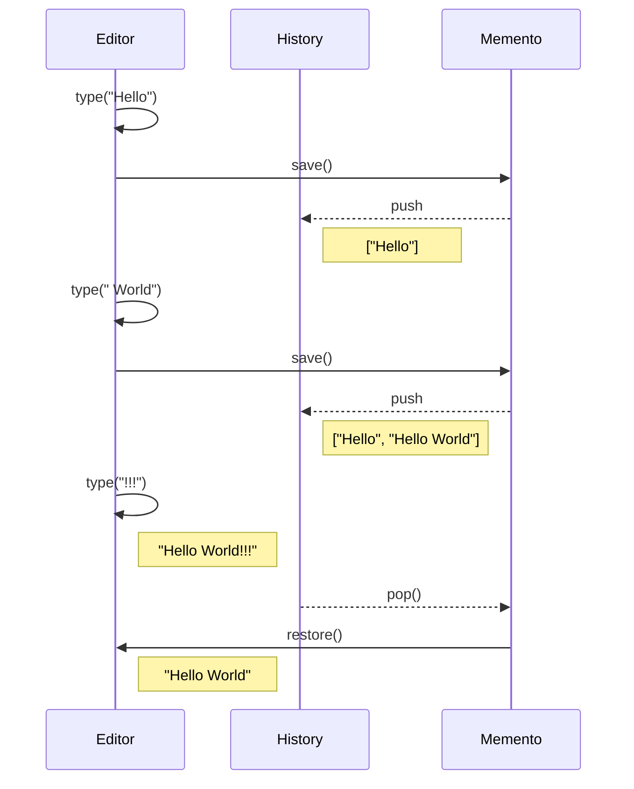

# Memento Pattern

## Intent

Without violating encapsulation, capture and externalize an object's internal state so that the object can be restored to this state later.

## Problem

You need to save and restore the previous state of an object without exposing its implementation details.

## Solution

Create memento objects that store snapshots of the originator's state, managed by a caretaker.

## Diagram



## Our Example

We implement a text editor with save/restore:

- **`types.ts`**: Defines the `Memento` interface
- **`editor.ts`**: `Editor` (originator), `EditorMemento`, and `History` (caretaker)
- **`index.ts`**: Demonstrates saving and restoring states

## State Flow



## Roles

| Role | Class | Responsibility |
|------|-------|----------------|
| **Originator** | `Editor` | Creates and restores from mementos |
| **Memento** | `EditorMemento` | Stores state snapshot |
| **Caretaker** | `History` | Manages memento lifecycle |

## When to Use

- When you need to save/restore an object's state (undo/redo, checkpoints)
- When direct access to state would violate encapsulation
- When you need to implement rollback functionality

## Run

```bash
bun run src/behavioral/memento/index.ts
```

