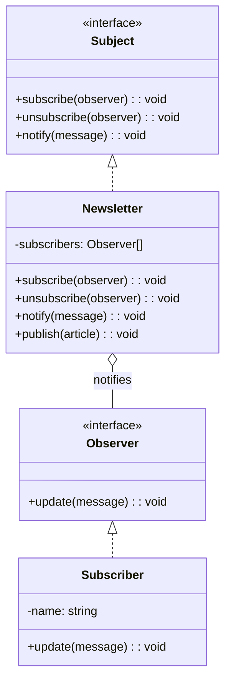
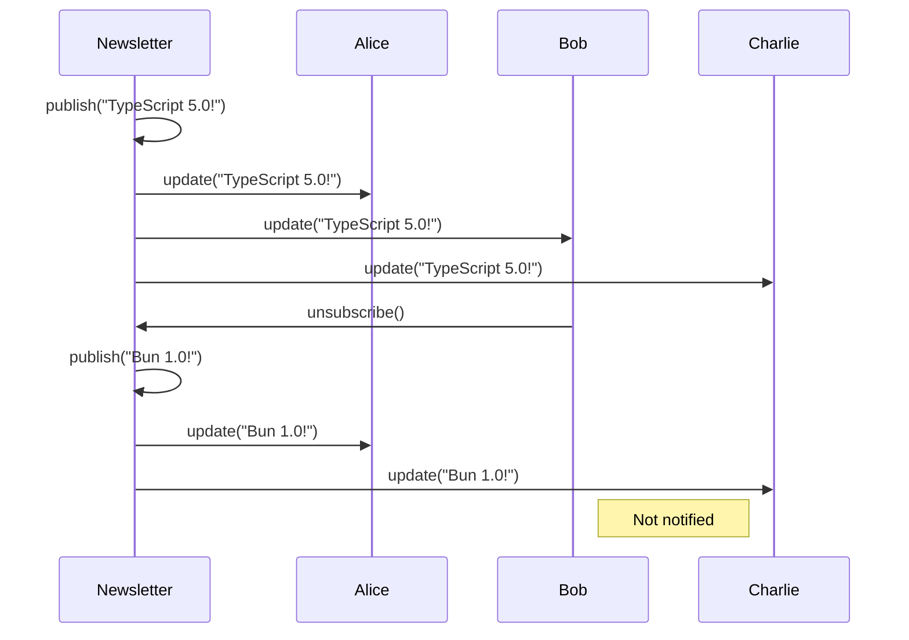

# Observer Pattern

## Intent

Define a one-to-many dependency between objects so that when one object changes state, all its dependents are notified and updated automatically.

## Problem

You need to notify multiple objects when an object's state changes, without coupling them tightly.

## Solution

Create a subscription mechanism where observers register with a subject and get notified of changes.

## Diagram



## Our Example

We implement a newsletter subscription system:

- **`types.ts`**: Defines `Observer` and `Subject` interfaces
- **`newsletter.ts`**: `Newsletter` (subject) and `Subscriber` (observer)
- **`index.ts`**: Demonstrates subscribe, publish, and unsubscribe

## Notification Flow



## Real-World Examples

- Event listeners in DOM
- RxJS Observables
- React state management
- Pub/Sub messaging systems

## When to Use

- When changes to one object require changing others, and you don't know how many
- When an object should notify others without assumptions about who they are
- When you need a broadcast communication mechanism

## Run

```bash
bun run src/behavioral/observer/index.ts
```

