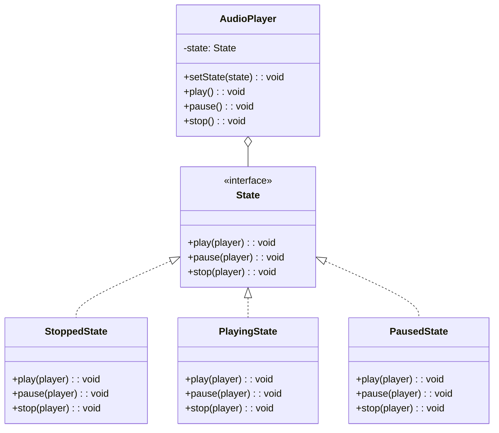
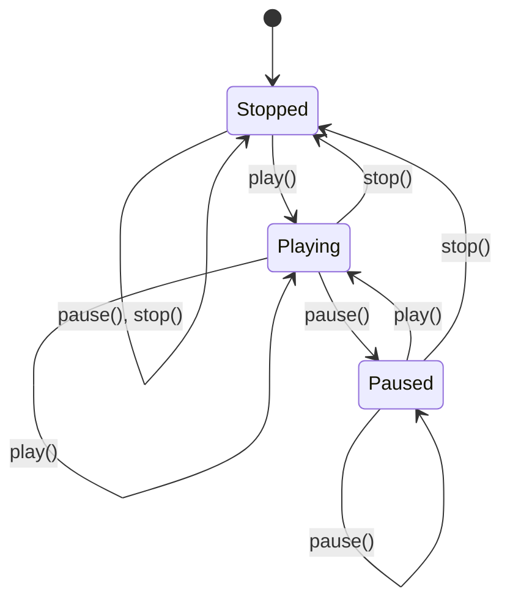

# State Pattern

## Intent

Allow an object to alter its behavior when its internal state changes. The object will appear to change its class.

## Problem

An object's behavior depends on its state, and you have complex conditional logic based on state.

## Solution

Encapsulate state-specific behavior into separate state classes and delegate to the current state object.

## Diagram



## Our Example

We implement a music player with states:

- **`types.ts`**: Defines `State` and `MusicPlayer` interfaces
- **`player.ts`**: State classes (`StoppedState`, `PlayingState`, `PausedState`) and `AudioPlayer`
- **`index.ts`**: Demonstrates state transitions

## State Transitions



## State vs Conditionals

```typescript
// ❌ Without State Pattern
play() {
  if (this.state === 'stopped') {
    this.state = 'playing';
  } else if (this.state === 'paused') {
    this.state = 'playing';
  }
  // More conditions...
}

// ✅ With State Pattern
play() {
  this.state.play(this);
}
```

## When to Use

- When object behavior depends on its state and changes at runtime
- When you have large conditional statements based on object state
- When you have duplicate code across state-dependent operations

## Run

```bash
bun run behavioral:state
```

