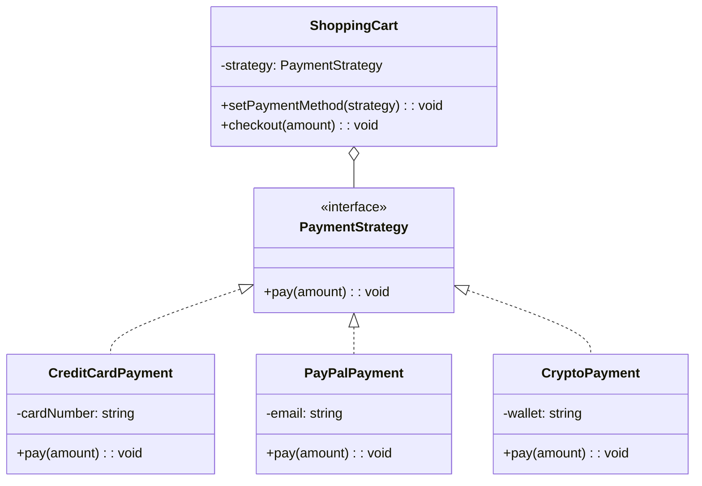
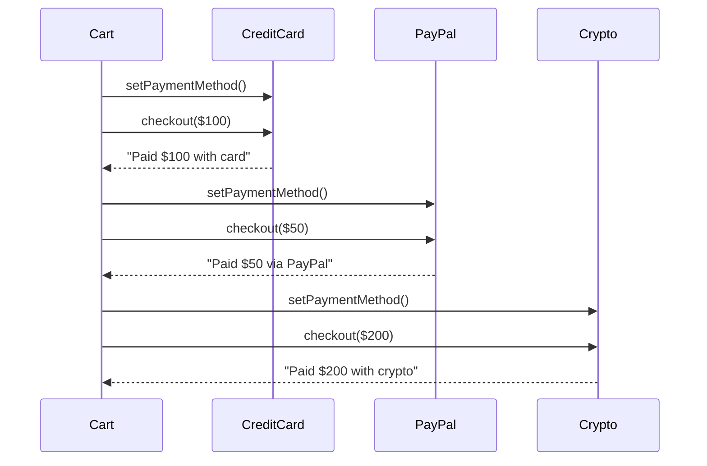

# Strategy Pattern

## Intent

Define a family of algorithms, encapsulate each one, and make them interchangeable. Strategy lets the algorithm vary independently from clients that use it.

## Problem

You need to use different variants of an algorithm within an object and switch between them at runtime.

## Solution

Extract each algorithm into separate classes with a common interface, and let the context delegate to a strategy object.

## Diagram



## Our Example

We implement a checkout system with multiple payment methods:

- **`types.ts`**: Defines the `PaymentStrategy` interface
- **`strategies.ts`**: Payment strategies and `ShoppingCart` context
- **`index.ts`**: Demonstrates switching payment methods

## Runtime Switching



## Strategy vs State

| Strategy | State |
|----------|-------|
| Algorithms are interchangeable | Behavior changes with state |
| Client chooses the strategy | State changes itself |
| Strategies are independent | States know about each other |

## When to Use

- When you have many related classes that differ only in behavior
- When you need different variants of an algorithm
- When you want to avoid conditional statements for selecting behavior
- When an algorithm uses data clients shouldn't know about

## Run

```bash
bun run src/behavioral/strategy/index.ts
```

