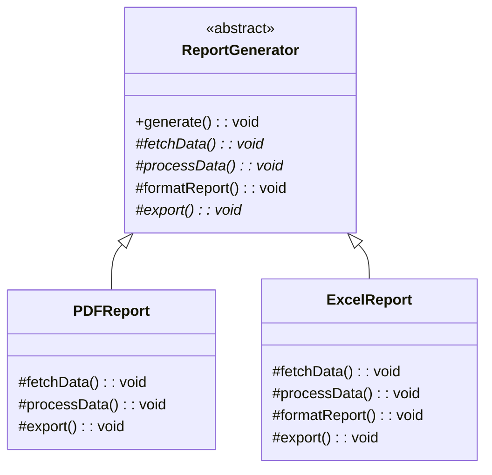
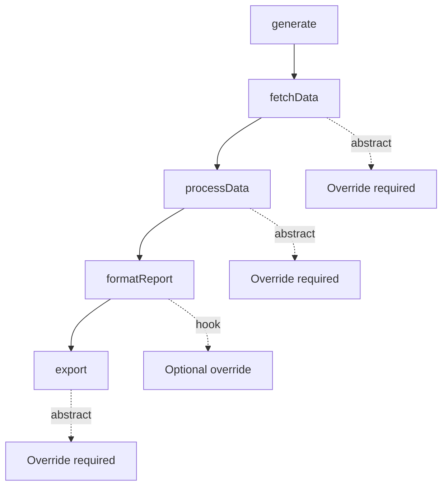

# Template Method Pattern

## Intent

Define the skeleton of an algorithm in an operation, deferring some steps to subclasses. Template Method lets subclasses redefine certain steps of an algorithm without changing the algorithm's structure.

## Problem

You have algorithms with similar structures but different implementations for certain steps.

## Solution

Define the algorithm structure in a base class method that calls abstract methods, which subclasses override.

## Diagram



## Our Example

We implement a report generation system:

- **`types.ts`**: Abstract `ReportGenerator` with template method `generate()`
- **`reports.ts`**: `PDFReport` and `ExcelReport` implementations
- **`index.ts`**: Generates both report types

## Algorithm Template



## Template Method Structure

```typescript
abstract class ReportGenerator {
  // Template method - defines algorithm structure
  generate(): void {
    this.fetchData();      // Step 1
    this.processData();    // Step 2
    this.formatReport();   // Step 3 (hook with default)
    this.export();         // Step 4
  }
  
  protected abstract fetchData(): void;
  protected abstract processData(): void;
  protected formatReport(): void { /* default */ }
  protected abstract export(): void;
}
```

## Hook Methods

`formatReport()` is a hook—it has a default implementation but can be overridden:
- `PDFReport`: Uses default formatting
- `ExcelReport`: Overrides with Excel-specific styles

## When to Use

- When you have algorithms with similar structures
- When you want to let clients extend specific steps without modifying structure
- When you have code duplication across similar algorithms

## Run

```bash
bun run src/behavioral/template-method/index.ts
```

