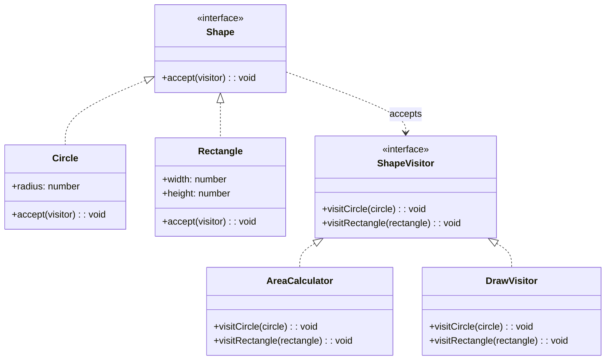
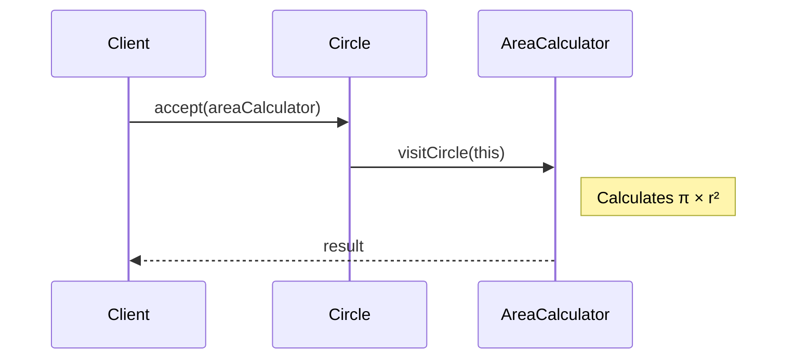
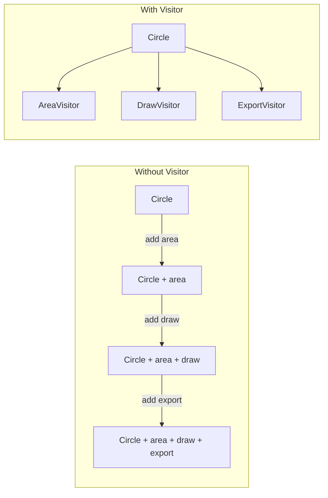

# Visitor Pattern

## Intent

Represent an operation to be performed on elements of an object structure. Visitor lets you define a new operation without changing the classes of the elements on which it operates.

## Problem

You need to perform many distinct operations on objects in a structure, and you don't want to pollute their classes with these operations.

## Solution

Create visitor classes that implement operations, and elements accept visitors that perform the operation.

## Diagram



## Our Example

We implement a shape system with multiple operations:

- **`types.ts`**: `Shape`, `ShapeVisitor`, `Circle`, and `Rectangle`
- **`visitors.ts`**: `AreaCalculator` and `DrawVisitor`
- **`index.ts`**: Applies different visitors to shapes

## Double Dispatch



The visitor knows which shape it's visiting, and the shape knows which visitor method to call—this is **double dispatch**.

## Adding Operations



## When to Use

- When you need to perform many unrelated operations on objects
- When the object structure rarely changes but operations change frequently
- When you want to avoid polluting element classes with operations
- When operations need to work with the concrete types

## Trade-offs

✅ **Pros**: Easy to add new operations  
❌ **Cons**: Hard to add new element types (must update all visitors)

## Run

```bash
bun run behavioral:visitor
```

