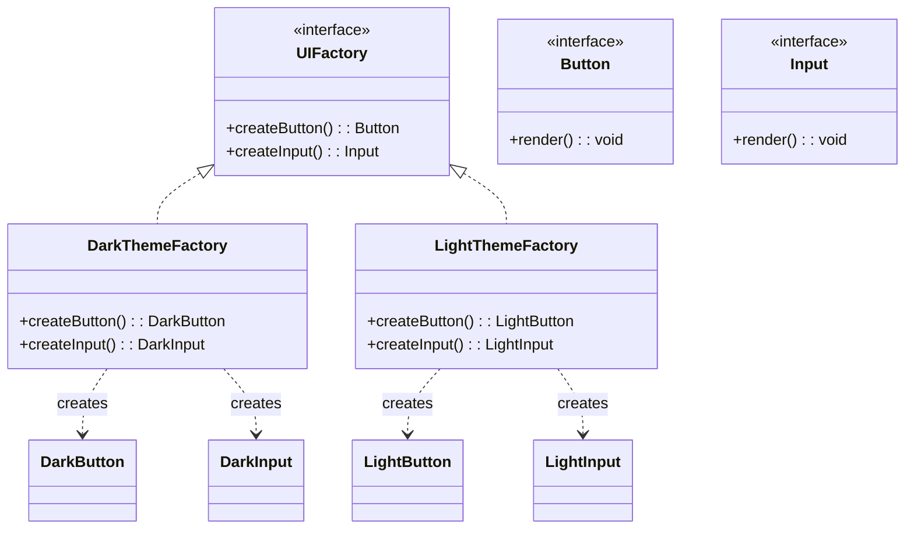

# Abstract Factory Pattern

## Intent

Provide an interface for creating families of related or dependent objects without specifying their concrete classes.

## Problem

You need to create objects that belong together (a family) and ensure they are compatible with each other.

## Solution

Create an abstract factory interface that declares creation methods for each product type, then implement concrete factories for each family.

## Diagram



## Our Example

We implement a UI component factory with two themes (Dark and Light):

- **`types.ts`**: Defines `Button`, `Input`, and `UIFactory` interfaces
- **`factories.ts`**: Implements `DarkThemeFactory` and `LightThemeFactory` with their respective components
- **`index.ts`**: Shows how to render UI with different themes

## When to Use

- When your code needs to work with various families of related products
- When you want to ensure products from one family are used together
- When you want to provide a library of products without exposing implementations

## Run

```bash
bun run src/creational/abstract-factory/index.ts
```

