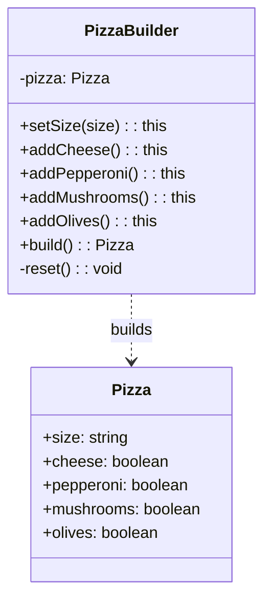

# Builder Pattern

## Intent

Separate the construction of a complex object from its representation so that the same construction process can create different representations.

## Problem

You need to create complex objects with many optional parameters, and constructor telescoping becomes unwieldy.

## Solution

Extract the object construction code into a separate builder class with a fluent interface that allows step-by-step construction.

## Diagram



## Our Example

We implement a pizza builder with a fluent API:

- **`types.ts`**: Defines the `Pizza` interface with all properties
- **`builder.ts`**: Implements `PizzaBuilder` with chainable methods
- **`index.ts`**: Creates different pizzas using the builder

## Key Features

```typescript
const pizza = new PizzaBuilder()
  .setSize("large")
  .addCheese()
  .addPepperoni()
  .build();
```

## When to Use

- When creating objects with many optional parameters
- When you want to create different representations of the same product
- When construction involves multiple steps that need to be executed in a specific order

## Run

```bash
bun run creational:builder
```

