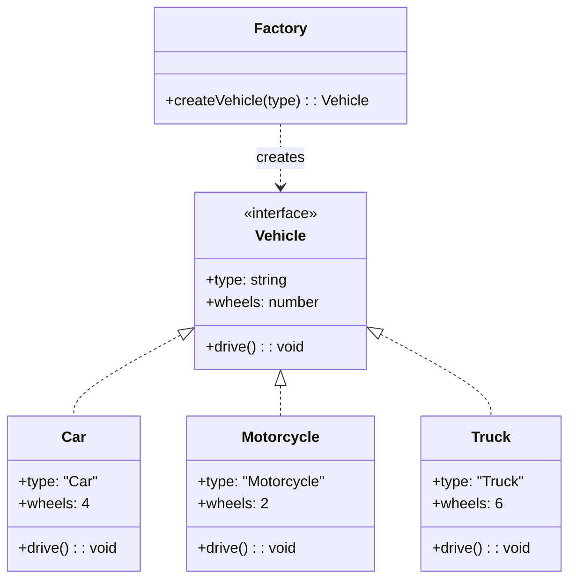

# Factory Pattern

## Intent

Define an interface for creating an object, but let subclasses decide which class to instantiate. Factory Method lets a class defer instantiation to subclasses.

## Problem

You need to create objects without specifying the exact class of object that will be created.

## Solution

Create a factory function or method that handles object instantiation based on input parameters.

## Diagram



## Our Example

We implement a vehicle factory that creates different types of vehicles:

- **`types.ts`**: Defines the `Vehicle` interface
- **`vehicles.ts`**: Implements `Car`, `Motorcycle`, and `Truck` classes
- **`factory.ts`**: Contains `createVehicle()` function that returns the appropriate vehicle
- **`index.ts`**: Demonstrates usage

## When to Use

- When you don't know ahead of time what class you need to instantiate
- When you want to delegate the responsibility of instantiation to subclasses
- When you want to centralize complex object creation logic

## Run

```bash
bun run src/creational/factory/index.ts
```

