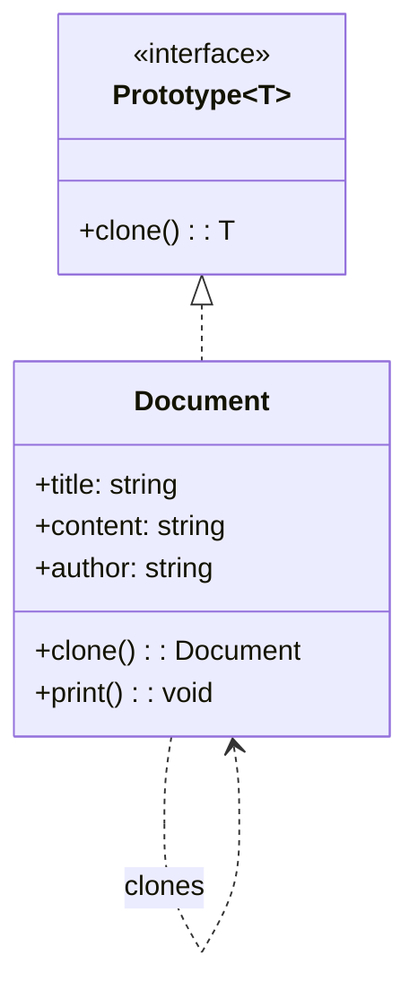
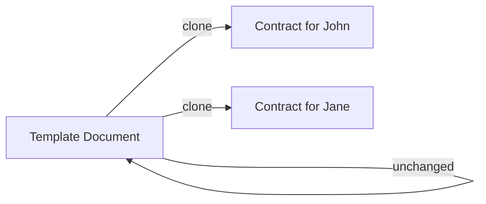

# Prototype Pattern

## Intent

Specify the kinds of objects to create using a prototypical instance, and create new objects by copying this prototype.

## Problem

You need to create copies of existing objects without depending on their concrete classes, or when object creation is expensive.

## Solution

Implement a `clone()` method in your objects that returns a copy of the object.

## Diagram



## Our Example

We implement a document cloning system:

- **`types.ts`**: Defines the generic `Prototype<T>` interface
- **`document.ts`**: Implements `Document` class with `clone()` method
- **`index.ts`**: Creates a template and clones it for different contracts

## Usage Flow



## When to Use

- When object creation is more expensive than copying
- When you need to create objects similar to existing ones
- When you want to reduce the number of subclasses

## Run

```bash
bun run src/creational/prototype/index.ts
```

