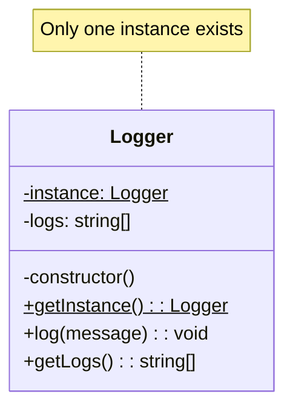

# Singleton Pattern

## Intent

Ensure a class has only one instance and provide a global point of access to it.

## Problem

You need exactly one instance of a class, and it must be accessible from a well-known access point.

## Solution

Make the constructor private and provide a static method that returns the same instance every time it's called.

## Diagram



## Our Example

We implement a Logger singleton:

- **`singleton.ts`**: Implements `Logger` class with private constructor and `getInstance()` static method
- **`index.ts`**: Demonstrates that multiple calls return the same instance

## Key Implementation

```typescript
class Logger {
  private static instance: Logger;
  
  private constructor() {} // Private!
  
  static getInstance(): Logger {
    if (!Logger.instance) {
      Logger.instance = new Logger();
    }
    return Logger.instance;
  }
}
```

## Verification

```typescript
const logger1 = Logger.getInstance();
const logger2 = Logger.getInstance();
console.log(logger1 === logger2); // true
```

## When to Use

- When exactly one instance of a class is needed
- For shared resources like database connections, loggers, or configuration
- When you need stricter control over global variables

## Caution

Singleton is often considered an anti-pattern because it:
- Makes unit testing harder
- Introduces global state
- Violates single responsibility principle

Consider dependency injection as an alternative.

## Run

```bash
bun run creational:singleton
```

