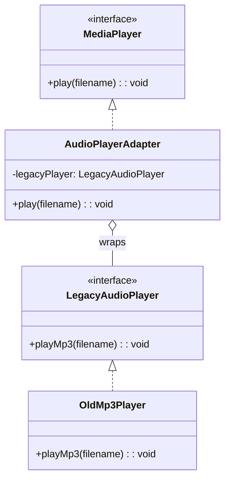
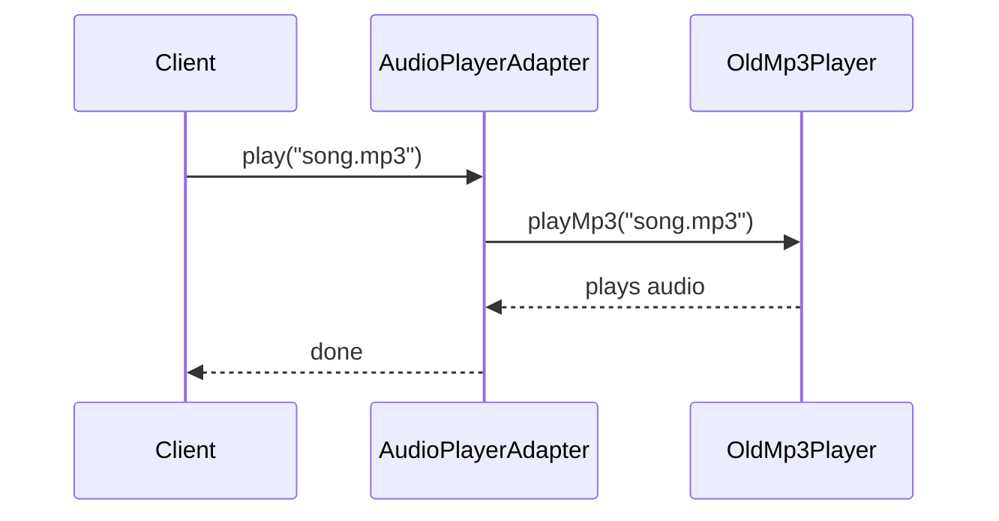

# Adapter Pattern

## Intent

Convert the interface of a class into another interface clients expect. Adapter lets classes work together that couldn't otherwise because of incompatible interfaces.

## Problem

You have a class with an interface that doesn't match what your client code expects, and you can't modify the original class.

## Solution

Create an adapter class that wraps the incompatible object and translates calls to the expected interface.

## Diagram



## Our Example

We adapt a legacy MP3 player to a modern media player interface:

- **`types.ts`**: Defines `MediaPlayer` (new) and `LegacyAudioPlayer` (old) interfaces
- **`legacy-player.ts`**: The old `OldMp3Player` class we can't modify
- **`adapter.ts`**: `AudioPlayerAdapter` wraps the legacy player
- **`index.ts`**: Client uses the new interface seamlessly

## Flow



## When to Use

- When you want to use an existing class but its interface doesn't match what you need
- When you need to create a reusable class that cooperates with unrelated classes
- When integrating with third-party or legacy code

## Run

```bash
bun run src/structural/adapter/index.ts
```

