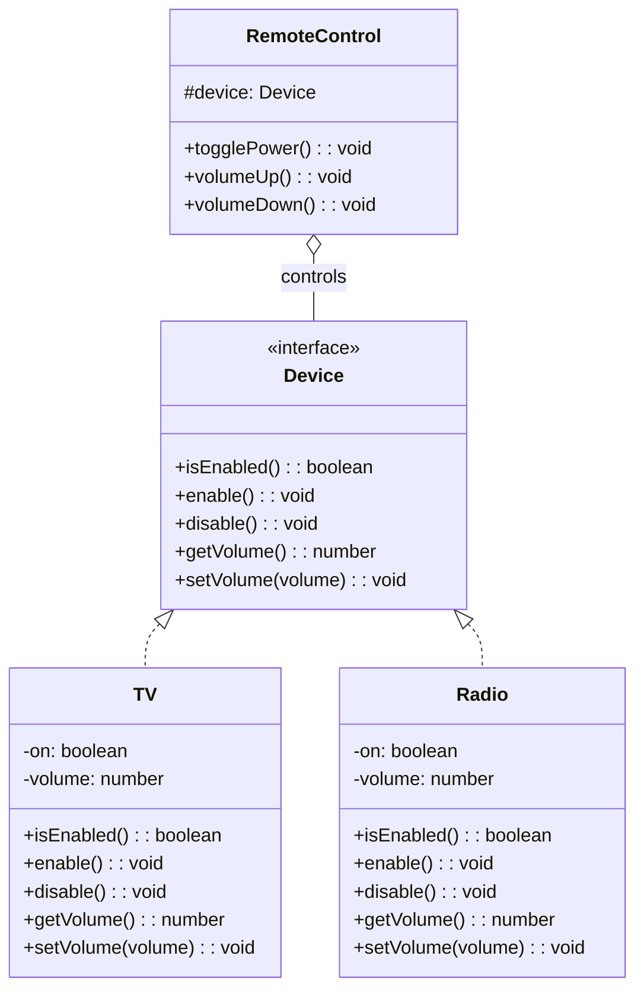
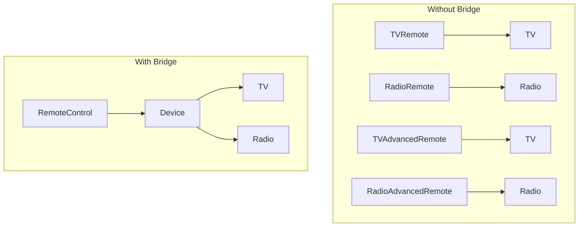

# Bridge Pattern

## Intent

Decouple an abstraction from its implementation so that the two can vary independently.

## Problem

You have a class hierarchy that grows in two dimensions (e.g., shapes and colors), leading to a class explosion.

## Solution

Separate the abstraction (what) from the implementation (how) by using composition instead of inheritance.

## Diagram



## Our Example

We implement a remote control system that can work with different devices:

- **`types.ts`**: Defines the `Device` interface
- **`devices.ts`**: Implements `TV` and `Radio` devices
- **`remote.ts`**: `RemoteControl` abstraction that works with any device
- **`index.ts`**: Same remote controls different devices

## Key Benefit



## When to Use

- When you want to avoid permanent binding between abstraction and implementation
- When both abstraction and implementation should be extensible by subclassing
- When you have a class explosion from combining multiple dimensions

## Run

```bash
bun run structural:bridge
```

