# Composite Pattern

## Intent

Compose objects into tree structures to represent part-whole hierarchies. Composite lets clients treat individual objects and compositions of objects uniformly.

## Problem

You have a tree structure where you need to treat individual objects and groups of objects the same way.

## Solution

Define a common interface for both simple and complex elements, where complex elements can contain other elements.

## Diagram


## Our Example

We implement a file system with files and folders:

- **`types.ts`**: Defines `FileSystemItem` interface
- **`file-system.ts`**: Implements `File` (leaf) and `Folder` (composite)
- **`index.ts`**: Builds a tree structure and calculates total size

## Tree Structure

```mermaid
graph TD
    root[📁 root] --> docs[📁 documents]
    root --> imgs[📁 images]
    root --> readme[📄 readme.md]
    
    docs --> resume[📄 resume.pdf]
    docs --> notes[📄 notes.txt]
    
    imgs --> photo[📄 photo.jpg]
    imgs --> icon[📄 icon.png]
```



## Key Feature

Both `File` and `Folder` implement `getSize()`:
- `File`: Returns its own size
- `Folder`: Recursively sums sizes of all children

## When to Use

- When you need to represent part-whole hierarchies
- When you want clients to ignore the difference between compositions and individual objects
- For tree structures like file systems, UI components, or organization charts

## Run

```bash
bun run src/structural/composite/index.ts
```

