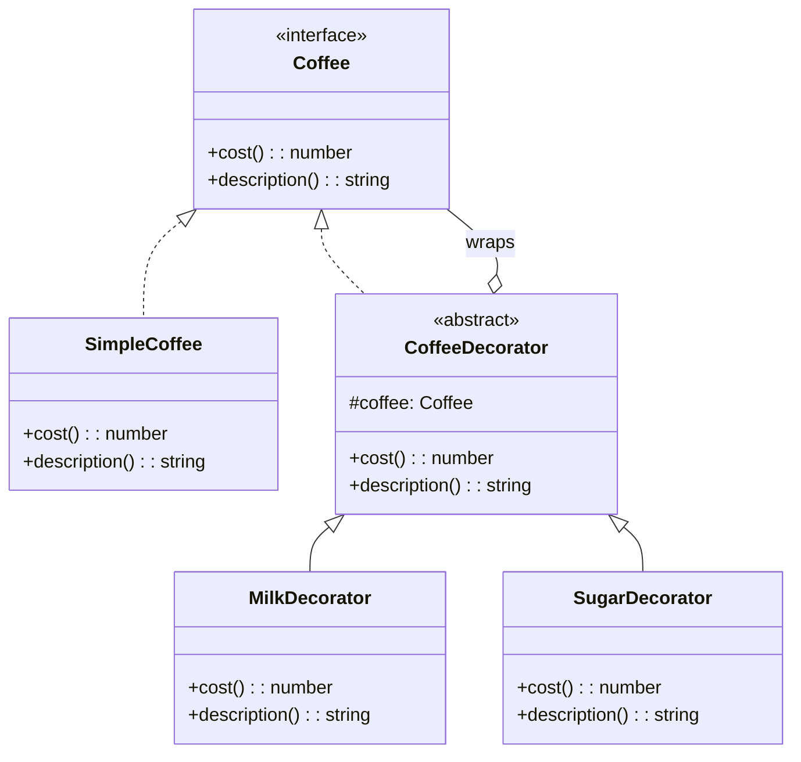

# Decorator Pattern

## Intent

Attach additional responsibilities to an object dynamically. Decorators provide a flexible alternative to subclassing for extending functionality.

## Problem

You need to add behavior to individual objects without affecting other objects of the same class, and subclassing would create too many combinations.

## Solution

Wrap the original object with decorator objects that add new behavior while delegating to the wrapped object.

## Diagram



## Our Example

We implement a coffee ordering system with add-ons:

- **`types.ts`**: Defines the `Coffee` interface
- **`coffee.ts`**: Implements `SimpleCoffee` and decorators (`MilkDecorator`, `SugarDecorator`, `WhippedCreamDecorator`)
- **`index.ts`**: Builds decorated coffees with cumulative pricing

## Decorator Chain


## Key Usage

```typescript
let coffee = new SimpleCoffee();           // $2.00
coffee = new MilkDecorator(coffee);        // $2.50
coffee = new SugarDecorator(coffee);       // $2.75
coffee = new WhippedCreamDecorator(coffee); // $3.50
```

## When to Use

- When you need to add responsibilities to objects dynamically
- When extension by subclassing is impractical
- When you need to combine multiple behaviors flexibly

## Run

```bash
bun run src/structural/decorator/index.ts
```

