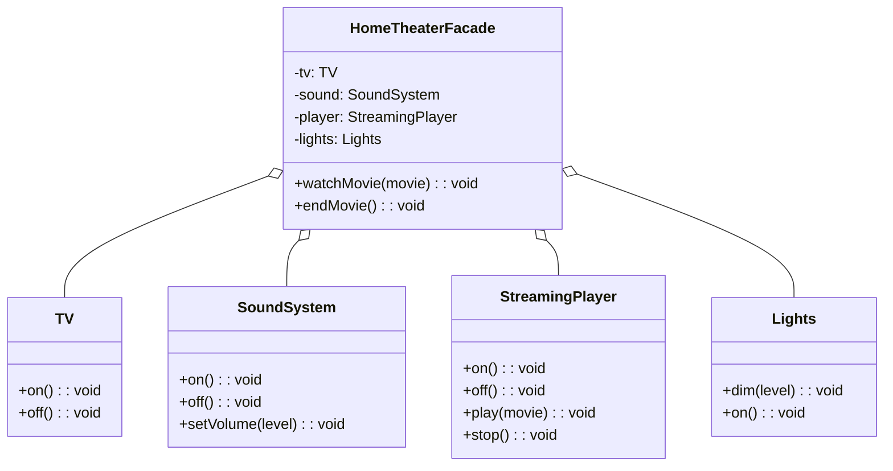
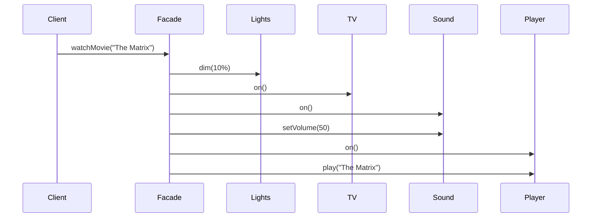

# Facade Pattern

## Intent

Provide a unified interface to a set of interfaces in a subsystem. Facade defines a higher-level interface that makes the subsystem easier to use.

## Problem

A complex subsystem has many interdependent classes, making it difficult for clients to use correctly.

## Solution

Create a facade class that provides a simple interface to the complex subsystem, coordinating the subsystem objects.

## Diagram



## Our Example

We implement a home theater system facade:

- **`subsystems.ts`**: Individual components (`TV`, `SoundSystem`, `StreamingPlayer`, `Lights`)
- **`facade.ts`**: `HomeTheaterFacade` simplifies complex operations
- **`index.ts`**: Client uses simple `watchMovie()` and `endMovie()` methods

## Simplification



Without the facade, the client would need to call 6 methods on 4 different objects!

## When to Use

- When you want to provide a simple interface to a complex subsystem
- When there are many dependencies between clients and implementation classes
- When you want to layer your subsystems

## Run

```bash
bun run src/structural/facade/index.ts
```

