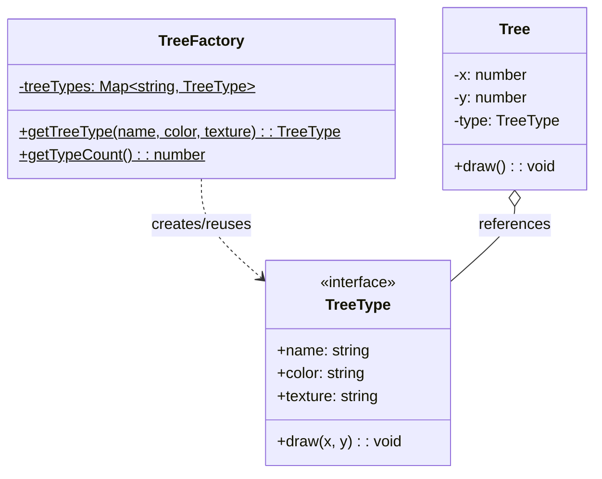
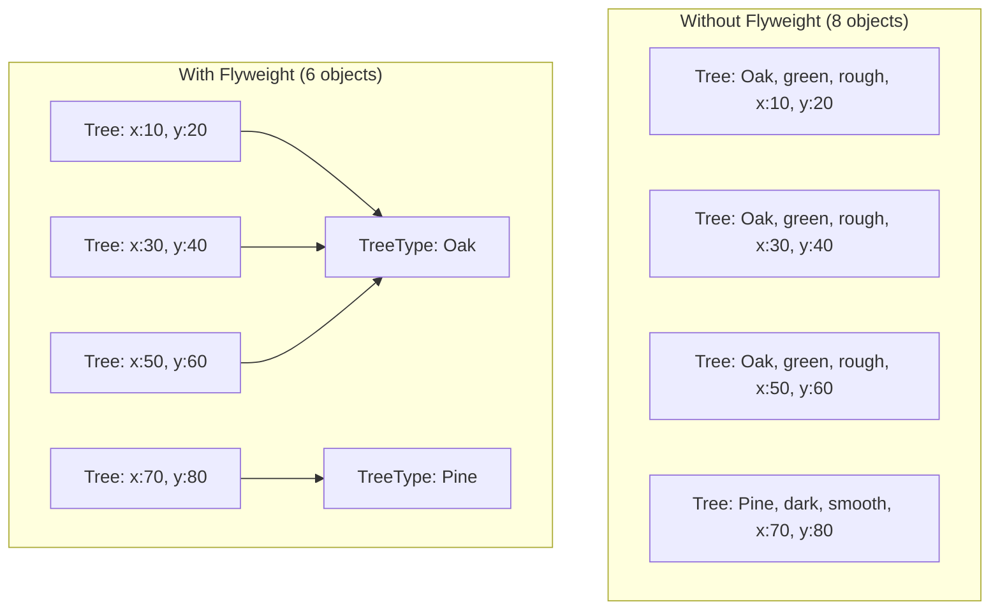

# Flyweight Pattern

## Intent

Use sharing to support large numbers of fine-grained objects efficiently.

## Problem

Your application needs to create a huge number of similar objects, consuming too much memory.

## Solution

Share the common (intrinsic) state between objects and pass the unique (extrinsic) state to methods when needed.

## Diagram



## Our Example

We implement a forest with shared tree types:

- **`types.ts`**: Defines `TreeType` interface (shared state)
- **`flyweight.ts`**: `TreeFactory` manages shared types, `Tree` holds unique position
- **`index.ts`**: Creates many trees with few shared types

## Memory Optimization



## Key Concepts

- **Intrinsic state**: Shared data stored in flyweight (name, color, texture)
- **Extrinsic state**: Unique data stored in context (x, y position)

## When to Use

- When your app uses a large number of objects
- When storage costs are high because of the quantity of objects
- When most object state can be made extrinsic
- When many objects can be replaced by few shared objects

## Run

```bash
bun run src/structural/flyweight/index.ts
```

