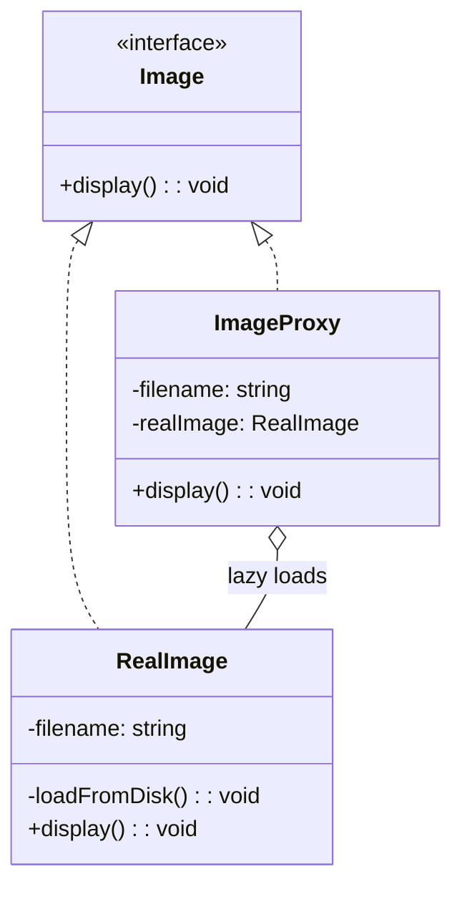
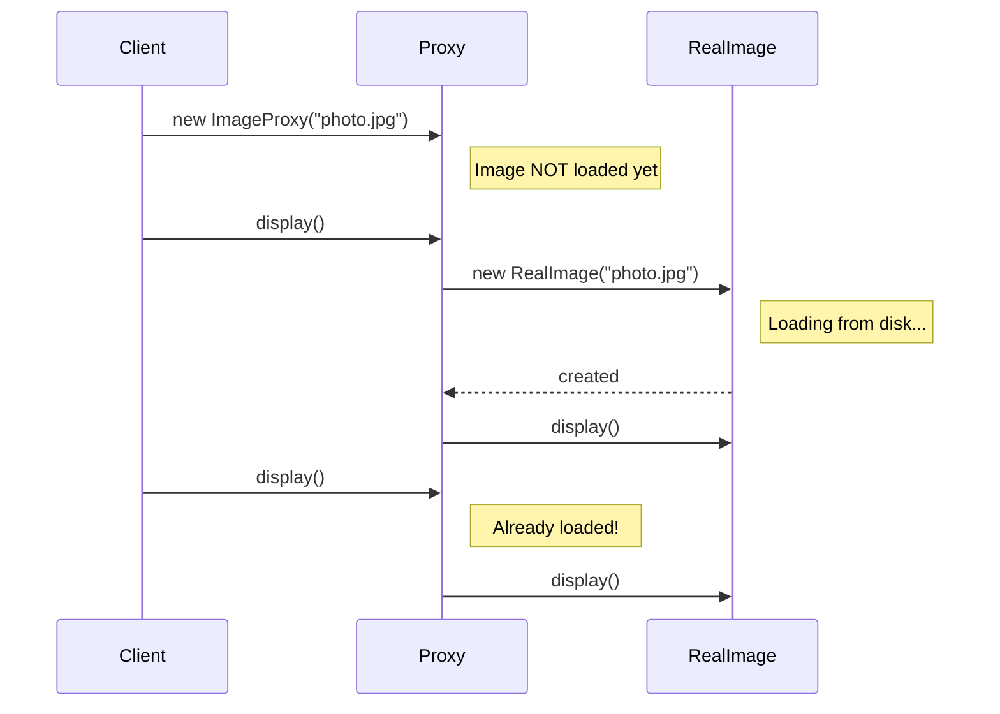

# Proxy Pattern

## Intent

Provide a surrogate or placeholder for another object to control access to it.

## Problem

You need to control access to an object—for lazy loading, access control, logging, caching, etc.

## Solution

Create a proxy class with the same interface as the original object that controls access to it.

## Diagram



## Our Example

We implement a virtual proxy for lazy-loading images:

- **`types.ts`**: Defines the `Image` interface
- **`proxy.ts`**: `RealImage` (expensive to create) and `ImageProxy` (delays loading)
- **`index.ts`**: Shows lazy loading behavior

## Lazy Loading Flow



## Types of Proxies

| Type | Purpose |
|------|---------|
| **Virtual** | Lazy loading (our example) |
| **Protection** | Access control |
| **Remote** | Local representation of remote object |
| **Logging** | Keep history of requests |
| **Caching** | Cache results |

## When to Use

- **Lazy initialization**: When you have a heavyweight object that you don't always need
- **Access control**: When you want to control access to an object
- **Logging/Caching**: When you want to add behavior without changing the original
- **Remote objects**: When the real object is in a different address space

## Run

```bash
bun run src/structural/proxy/index.ts
```

